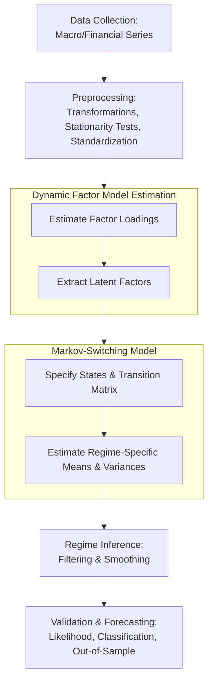

# Brief prototyping of Markov-Switching models for macroeconomic regime estimation

---
### Models:
- ```.\MS-AR\``` contains modelling for a simple univariate MS-AR (markov-switching autoregressive) model
  - $y_t = \mu_{s_{t}} + \Phi_{s_{t}}y_{t-1} + \epsilon_t, \epsilon $
  - *i.e.*, uses a single target variable (in this case GDP YoY %, i.e. $\frac{GDP_{t}}{GDP_{t-4}} * 100\%$ given quarterly data) and assumes autocorrelation switches, as well as mean and variance switching between regimes 
    - cons include omitting comovements in labor, inflation, credit spreads, etc. and susceptability to idosyncratic noise in GDP (revisions, seasonality, etc.)
  - Initially estimate k=2 states (keeping with the idea of simplicity for the univariate model) as this only gives four regime parameters (two means, two variances) + the 4x4 transition matrix
    - this also makes intuitive sense when targeting GDP as two states can represent *expansion* and *contraction* which can then be mapped to NBER "recession/not" calls for validation
    - Using 3 states would be good for capturing nuance (i.e. "good", "base", "bad" = "overheated growth", "garden variety growth/mild slowdown", and "full blown recession") but I'll leave this for the future, just want a MVP prototype for now as that would introduce a much greater complexity cost
- ```.\Multivariate\``` contains modelling for a multivariate MS-AR model
  - *i.e.*, uses **[VARIABLES]**
    - pros include capturing richer dynamics from different corners of the macroeconomic system and robustness to noise in any single series
    - cons include risk of overfitting and increased comlexity on all fronts

---
### Notes:
- whichever markov-switching model is chosen (or multiple), we can then extract the estimated regime specific moments and transition matrix to be used in the monte-carlo method
- a decently comprehensive, "full scale" model in the future should try utilizing a Dynamic Factor Model for distillation of 2-3 latent factors from a greater number of macroeconomic/industry/financial variables and let those factors switch regimes (see the pipeline diagram below)
  - this keeps the state-space small but information-rich
  - this does however increase inherent complexity as it requires a "two-stage" estimation process (estimating latent factors first, then modelling regime switching on the factors, and then 'reconstructing' the observed variables)

- From ChatGPT (o4-mini):

> ### Which should you pick?
> - If you’re prototyping or sample length is short (< 100 obs), start univariate on GDP YoY. You’ll get a baseline “growth regime” quickly.
> - If you have 5–10 good series and want to see, say, a “financial‐stress regime” as well as a “growth regime,” go multivariate—but constrain your covariance matrix (e.g. diagonal) or tie variances across states.
> - If you’ve got a long panel (30+ series, 200+ obs) and care about a robust, data-rich delineation of regimes, the MS-DFM is the way to go. You’ll capture co-movements without drowning in parameters.
>
> **Rule of thumb:** let data guide complexity. Fit the uni- and bivariate models first, compare regime-classification and in-sample likelihood. If you see persistent misclassifications (e.g. recessions not flagged, or false alarms), that’s a signal you need extra factors or a DFM backbone.

---
### Structure:
- largely relies on ```statsmodels``` module, they provide great methods for regime-switching models
  - they also provide some really good example demonstrations:
    - [Markov Switching Autoregression Models](https://www.statsmodels.org/dev/examples/notebooks/generated/markov_autoregression.html)
    - [Markov Switching Dynamic Regression Models](https://www.statsmodels.org/dev/examples/notebooks/generated/markov_regression.html)
- just Python Notebooks for exploration/research purposes
  - it should run smoothly from top-to-bottom, can either run from **[NEXT]**
  - data is simply grabbed via FRED api, need "FRED_API_KEY" stored in environment variables if re-running ```data.ipynb```
  - A full package structure for a production markov-switching model could look something like the following (or could look different):
```aiignore
regime-switching/
│
├── data/
│   ├── processed/xyz_data.csv   # or whatever storage method is desired (probably something better than csv's)
│   └── factors/xyz_factors.csv  # if using Dynamic Factor Model
├── msmodel/
│   ├── preprocess.py            # data retrieval/processing (i.e. transformations/standardization & tests for things like stationarity
│   ├── DFM.py                   # if using DFM (loads csv → estimation & extraction of factors → store)
│   ├── modelling.py             # loads factors → grid‑search → save pickle
│   ├── validate.py              # diagnostics, oos tests, plots, etc.
│   └── __init__.py
└── notebooks/
    └── 01_explore_fit.ipynb     # ad‑hoc EDA
```
